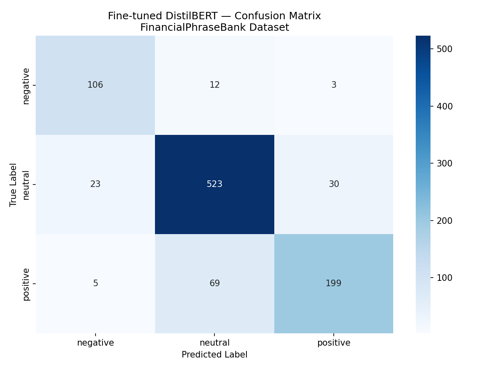

# Financial Sentiment Analyser

Fine-tuned DistilBERT on the FinancialPhraseBank dataset for 3-class
financial sentiment classification (positive / neutral / negative).

[](https://huggingface.co/Anamali153/financial-sentiment-distilbert)

## Results

| Model | F1 Score |
|-------|----------|
| RoBERTa zero-shot (baseline) | 0.6447 |
| DistilBERT fine-tuned (ours) | 0.8349 |
| **Improvement** | **+19.0%** |

## Per-class Performance

| Class | Precision | Recall | F1 |
|-------|-----------|--------|----|
| Negative | 0.76 | 0.88 | 0.82 |
| Neutral | 0.89 | 0.84 | 0.87 |
| Positive | 0.77 | 0.79 | 0.78 |



## Model Weights
Hosted on HuggingFace Hub (not committed to this repo, to keep it lightweight):
**[Anamali153/financial-sentiment-distilbert](https://huggingface.co/Anamali153/financial-sentiment-distilbert)**

## Dataset
FinancialPhraseBank (Malo et al., 2014) — 4,846 sentences with 50%+ annotator agreement,
annotated by 16 people with financial market expertise.

## How to Run

```bash
git clone https://github.com/anamali153/financial-sentiment-analyser
cd financial-sentiment-analyser
pip install -r requirements.txt
python app.py
```

The app automatically pulls model weights from HuggingFace Hub on first run.

## Key Decisions
- Used weighted F1 as the metric due to class imbalance (neutral ~59%)
- max_length=128 tokens based on EDA of sentence lengths
- 4 training epochs, lr=2e-5, batch size=16
- Compared against a general-purpose zero-shot model (RoBERTa) as baseline
  to isolate the effect of domain-specific fine-tuning
- Model weights hosted on HuggingFace Hub rather than committed to git,
  following standard ML engineering practice for large binary artifacts
